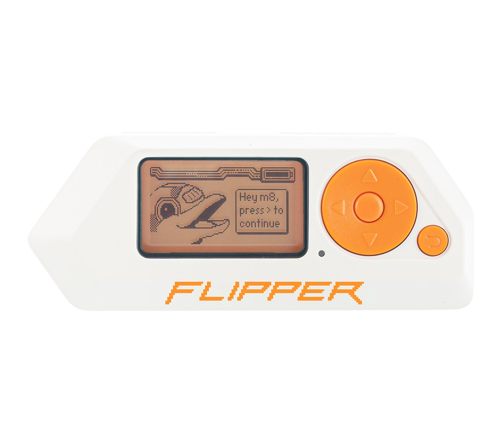
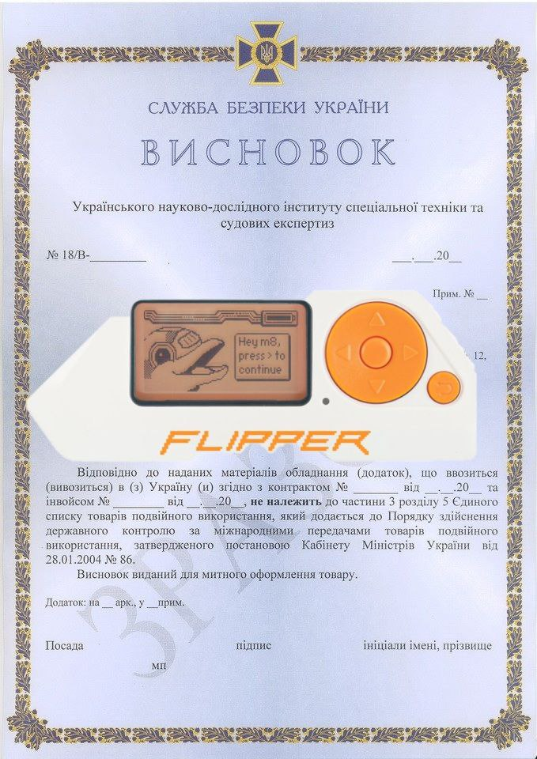

# Flipper-Zero-sbu
Flipper  Zero sbu
# Ukraine customs docs

При замовленні платформи для розробки Flipper Zero, моделі F.Z1 з закордону можуть виникнути склоднощі з таможеним оформленням даного товару, 
так, як вміст відправлення складає товар, який може належати до товарів категорії 
`«спеціальні засоби відмикання замикаючих пристроїв для проникнення у приміщення,
сховища, транспортні засоби тощо»`,
що оформлюється виключно після отримання висновку **Служби безпеки України** відповідно до відповідно до  
ПКМУ «Про затвердження Порядку здійснення державного контролю за міжнародними передачами товарів подвійного використання» від 28 січня 2004 р. №86, 
де зазначений вид товару внесений у ЄДИНИЙ СПИСОК товарів подвійного використання: `5A903.e - спеціальні засоби відмикання замикаючих пристроїв для проникнення у приміщення, сховища, транспортні засоби тощо.`

Таким чином, окрім стандартного пакету документів, для митного оформлення даного типу товару, отримувачу необхідно надати відповідний висновок Служби безпеки України. Нижче буде детальна інструкція як це зробити **самому** швидко та без зайвої мороки.

Отримання висновку є безкоштовним та не займе багато вашого часу (до 10 робочих днів за умови вірно заповнених документів), мені надіслали за 3 доби, я спробую поділитись своїм досвідом отримання 



щойно забрав з Нової почти, знайомтесь - m8 ;)
###  Підготовчі документи 

1. Скан копія паспорту вашого. Дуже бажанно мати всі сторінки в одному PDF 
2. Заява на ім'я директора. `` docs/Заява макет.docx``. Заповнюємо червоні вставки своїми даними
3. Товаро супровідні документи (інвойс та товарна накладна).

Тут трохи детальніше. Мені надіслав інвойс та товарну накладу митний брокер компанії Нова Пошта, який безпосередньо і займався митним оформленням мого фліпера, проте
отримувати висновок СБУ необхідно самому. Компанія Нова Пошта не співпрацює з СБУ, я питав.

4. Технічна документація на прилад перекладена на Українську мову.
``
 docs/Flipper Zero Документація ukr.pdf
``

Матеріал взято з https://docs.flipperzero.one, можуть бути деяки деякі неточності перекладу, але цього достатньо

### **ОБОВ'ЯЗКОВИМ КРОКОМ Є НЕОБХІДНІСТЬ ПІДПИСАТИ ВИЩЕ ЗГАДАНІ ДОКУМЕНТИ!!**

Для цього використаємо сервіс ДІЯ ПІДПИС ( https://ca.diia.gov.ua/sign ) або можете своїм власним ЕЦП це зробити 

## Створюємо email

#### Отримувач
``visnovok_icte@ssu.gov.ua``
#### Тема листа ####
`` Висновок ІСТЕ СБУ - ВАШ ТРЕК НОМЕР - ПІБ
``

#### Повідомлення

```
Доброго дня!

Прошу надати висновок щодо не належності товару, який може відноситись до товарів категорії «спеціальні засоби відмикання замикаючих пристроїв для проникнення у приміщення, 
сховища, транспортні засоби тощо», що оформлюється виключно після отримання висновку Служби безпеки України відповідно до відповідно до  ПКМУ «Про затвердження 
Порядку здійснення державного контролю за міжнародними передачами товарів подвійного використання» 
від 28 січня 2004 р. №86, де зазначений вид товару внесений у ЄДИНИЙ СПИСОК товарів подвійного використання: 
5A903.e - спеціальні засоби відмикання замикаючих пристроїв для проникнення у приміщення, сховища, транспортні засоби тощо для митного офорлмення

Інформація про замовлений товар:

Платформа для розробки та програмування - Flipper Zero, кількість - ВАША КІЛЬКІСТЬ товару. Країна походження - США

ЕН - ВАШ НОМЕР ЕЛЕКТРОННОЇ НАКЛАДНОЇ
Інвойс - ВАШ НОМЕР ІНВОЙСУ від ДАТА ІНВОЙСУ
Номер телефону - ВАШ НОМЕР ТЕЛЕФОНУ
EMAIL - ВАШ EMAIL


З повагою, 
ВАШЕ ПІБ
 ```

Прикріплюємо до листа всі документи з 1го пункту обов'язково підписаними за допомогою ЕЦП, та всі файли підпису для контрольної перевірки.
Також додаємо до листа всі файли з папки ATTACH_TO_LETTER, _підписувати не треба_


Це в принципі все, як результат ви отримаєте висновок, схожий на цей,

та матимете змогу нарешті забрати свого дельфіна та ~~зламати собі ключі від Mazerati~~ вивчати нові протоколи

Якщо у вас виникнуть питання можете писати мені в тг **@ol3eh** або зателефонувати на гарячу лінію СБУ -
**(044) 422-74-44**, де дуже люб'язно вам допоможуть.


За допомогу в митному оформленні фліпера


